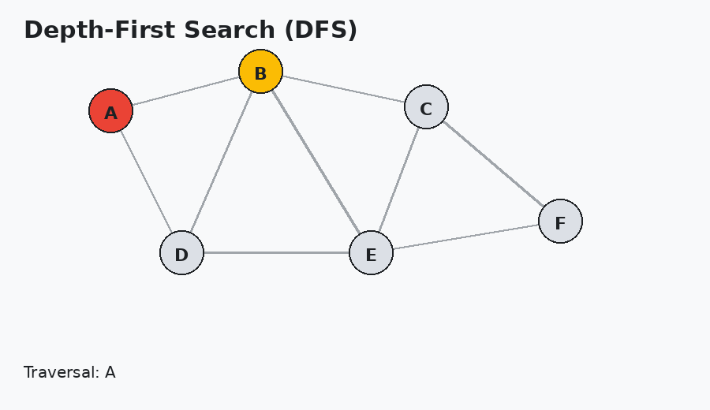
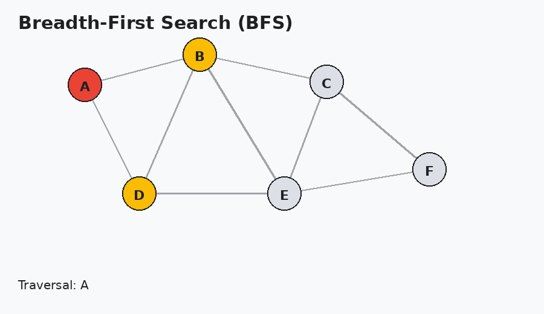
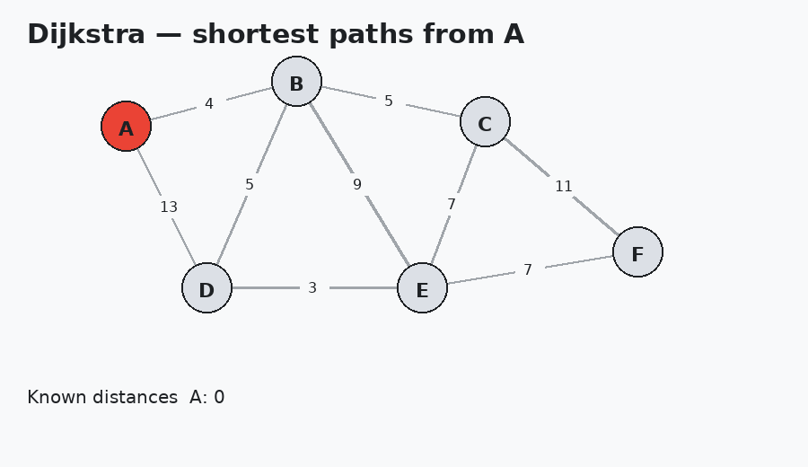
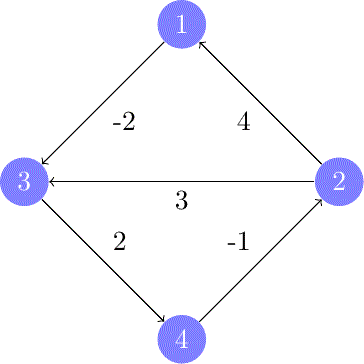
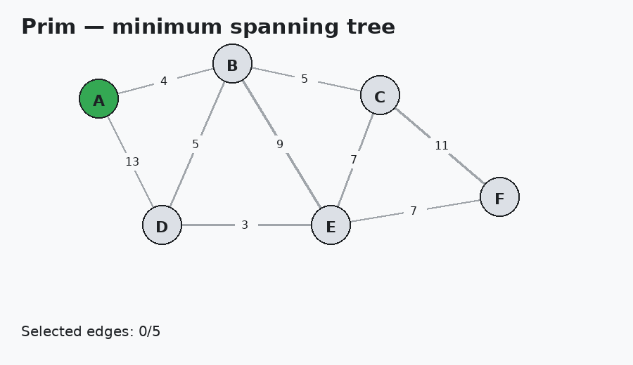
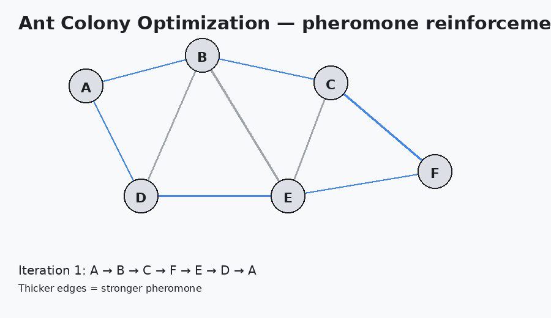
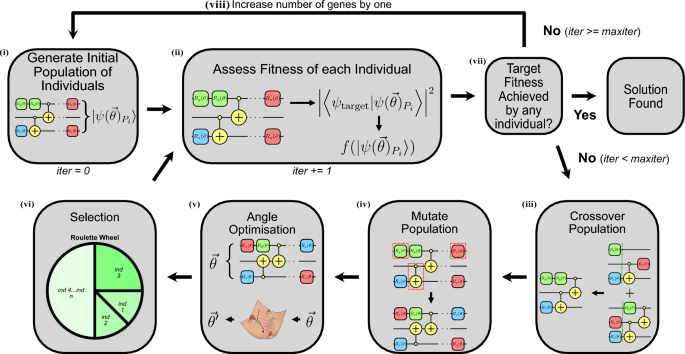
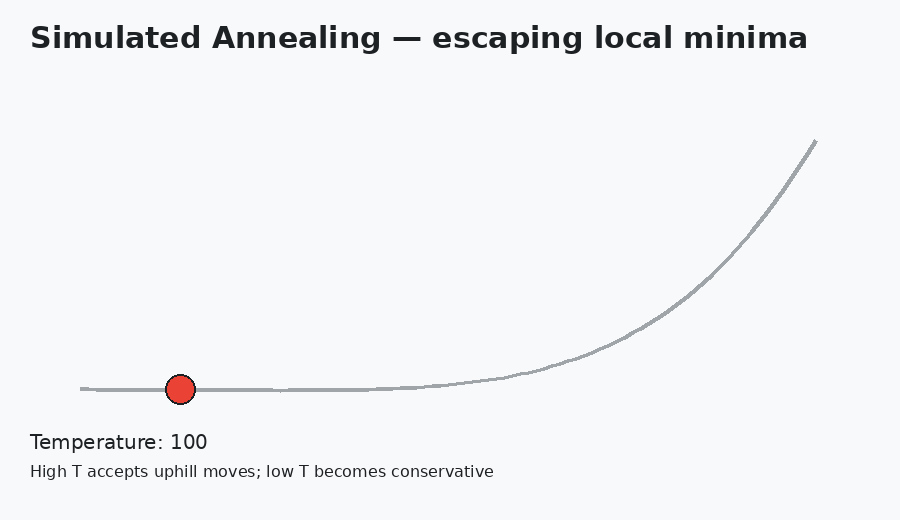
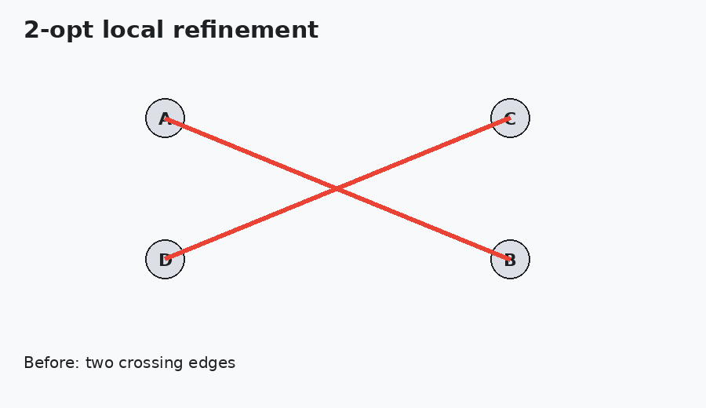

# Simple Navigator — Graph Algorithms in Kotlin

A Kotlin implementation of fundamental graph algorithms, from graph traversal and shortest-path search to minimum spanning trees and heuristic solutions for the Traveling Salesman Problem.

The project includes a reusable graph abstraction, custom stack and queue data structures, classical deterministic algorithms, three TSP metaheuristics, local 2-opt refinement, Graphviz export, unit tests, and an interactive console interface.

## Features

### Graph representation

The `Graph` abstraction stores weighted graphs using an adjacency matrix and supports:

- loading a graph from a file;
- accessing vertices, neighbors, and edge weights through a public API;
- exporting a graph to Graphviz DOT format.

`GraphAlgorithms` is intentionally decoupled from the graph's internal representation and operates only through the public `Graph` API.

## Traversal

### Depth-First Search

Iterative DFS is implemented using a custom stack.

  

### Breadth-First Search

BFS is implemented using a custom queue and explores the graph level by level.

  

## Shortest paths

### Dijkstra's algorithm

Finds the shortest distance between two selected vertices in a weighted graph.

  

### Floyd–Warshall algorithm

Computes shortest paths between every pair of vertices using dynamic programming over allowed intermediate vertices.

  

## Minimum spanning tree

### Prim's algorithm

Builds a minimum spanning tree by repeatedly attaching the cheapest edge that connects the growing tree to a new vertex.

  

## Traveling Salesman Problem

The project explores three different metaheuristic approaches to the Traveling Salesman Problem.

### Ant Colony Optimization

Artificial ants probabilistically construct tours using both local edge desirability and a shared pheromone matrix. Good tours reinforce their edges, while pheromone evaporation prevents the search from locking onto early choices too aggressively.

  

### Genetic Algorithm

The implementation evolves a population of candidate tours. TSP solutions are represented as permutations of graph vertices.

The implementation uses:

- greedy and randomized population initialization;
- **Tournament Selection**;
- **elitism**;
- **Order Crossover (OX)**;
- **Swap Mutation**;
- deterministic random seeding for reproducible runs.

  

### Simulated Annealing

This solver explores one solution trajectory. Better neighbors are always accepted, while worse neighbors may still be accepted according to the current temperature. As the system cools, the search gradually changes from broad exploration to conservative local improvement.

  

### 2-opt local refinement

All heuristic TSP solutions are additionally refined using **2-opt**. The local search reverses route segments whenever doing so produces a shorter valid tour.

  

This creates a useful hybrid pattern:

> **global metaheuristic search → local refinement**

## TSP algorithm comparison

The console application can benchmark all three TSP solvers on the currently loaded graph:

- Ant Colony Optimization;
- Genetic Algorithm;
- Simulated Annealing.

For a user-defined number of repetitions `N`, each solver is executed repeatedly and its total execution time is measured.

## Console application

The CLI supports:

1. Loading a graph from a file.
2. DFS traversal.
3. BFS traversal.
4. Finding the shortest path between two vertices.
5. Computing all-pairs shortest paths.
6. Building a minimum spanning tree.
7. Solving the Traveling Salesman Problem.
8. Comparing the runtime of multiple TSP algorithms.
9. Exporting graphs to DOT.

## Algorithms at a glance

| Problem | Algorithm |
|---|---|
| Graph traversal | Depth-First Search |
| Graph traversal | Breadth-First Search |
| Single-pair shortest path | Dijkstra's algorithm |
| All-pairs shortest paths | Floyd–Warshall algorithm |
| Minimum spanning tree | Prim's algorithm |
| Traveling Salesman Problem | Ant Colony Optimization |
| Traveling Salesman Problem | Genetic Algorithm |
| Traveling Salesman Problem | Simulated Annealing |
| Tour refinement | 2-opt local search |

## What this project covers

The project brings together several algorithmic ideas:

- graph representation;
- stacks and queues;
- iterative graph traversal;
- shortest-path algorithms;
- dynamic programming;
- greedy algorithms;
- minimum spanning trees;
- combinatorial optimization;
- heuristic and metaheuristic search;
- evolutionary algorithms;
- local search;
- reproducible benchmarking.

## Tech stack

- **Kotlin**
- **Makefile**
- **Unit tests**
- **Graphviz DOT**